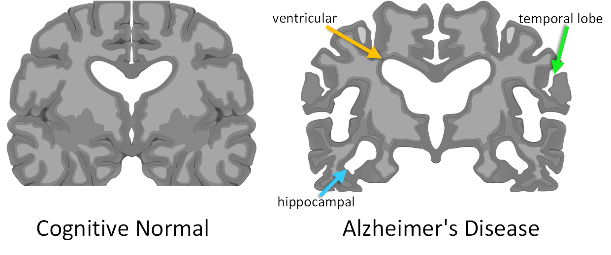

# Alzheimer’s disease
Alzheimer’s disease (AD) is an irreversible neurodegenerative disease that results in a loss of mental function caused by the deterioration of brain tissue. It is the most common cause of dementia among people over the age of 65, affecting an estimated 5.5 million Americans, yet no prevention methods or cures have been discovered.


## 1.	Stages of Alzheimer’s disease
1.	CN - Cognitive Normal
2.	MCI - Cild Cognitive Impairment
3.	AD - Alzheimer’s disease


## 2.	Region of Interest
1.	Ventricular
2.	Temporal lobe
3.	Hippocampal





# Usage

- Environment

    - Python 3.6

    - TensorFlow 2.2, TensorFlow Addons 0.10.0

    - OpenCV, scikit-image, tqdm, oyaml

    - *we recommend [Anaconda](https://www.anaconda.com/distribution/#download-section) or [Miniconda](https://docs.conda.io/en/latest/miniconda.html#linux-installers), then you can create the TensorFlow 2.2 environment with commands below*

        ```console
        conda create -n tensorflow-2.2 python=3.6

        source activate tensorflow-2.2

        conda install scikit-image tqdm tensorflow-gpu=2.2

        conda install -c conda-forge oyaml

        pip install tensorflow-addons==0.10.0
        ```

    - *NOTICE: if you create a new conda environment, remember to activate it before any other command*

        ```console
        source activate tensorflow-2.2
        ```

- Dataset

    - Alzheimer’s Disease Neuroimaging Initiative (ADNI) dataset can be downloaed  [here](http://adni.loni.usc.edu/)

    

- Example of training

    ```console
    CUDA_VISIBLE_DEVICES=0 python train.py --dataset adni
    ```

    - tensorboard for loss visualization

        ```console
        tensorboard --logdir ./output/summer2winter_yosemite/summaries --port 6006
        ```

- Example of testing

    ```console
    CUDA_VISIBLE_DEVICES=0 python test.py --experiment_dir ./output/adni
    
    
    ```
    
- ADNI Results
    
    
